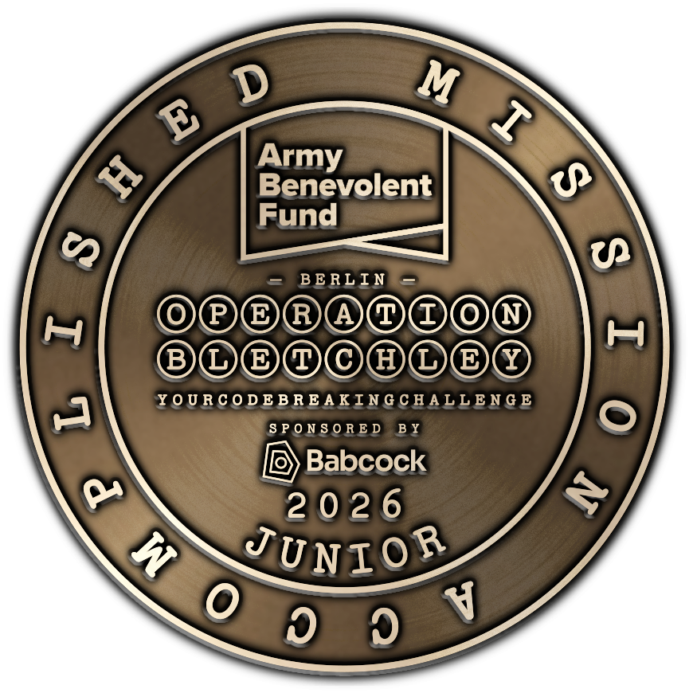
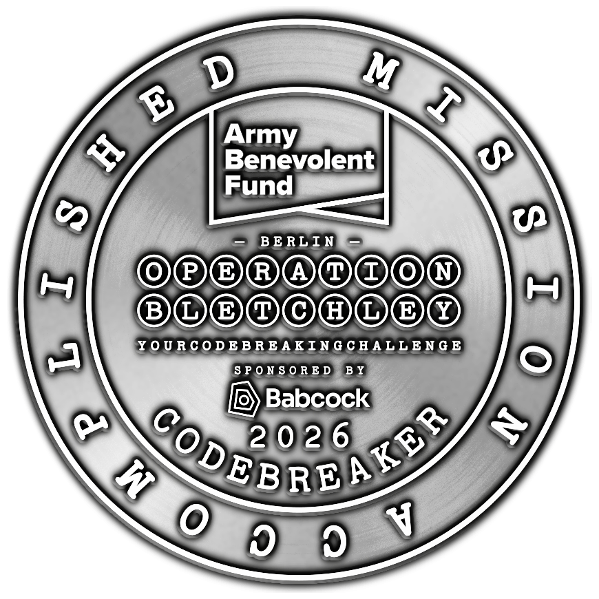
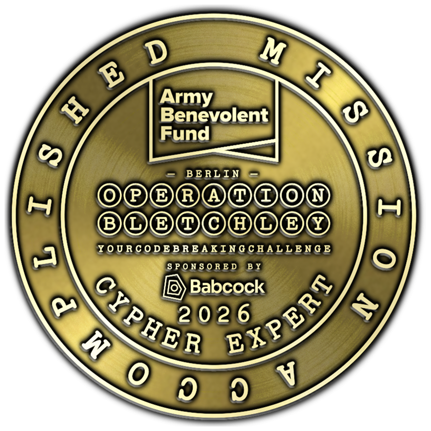
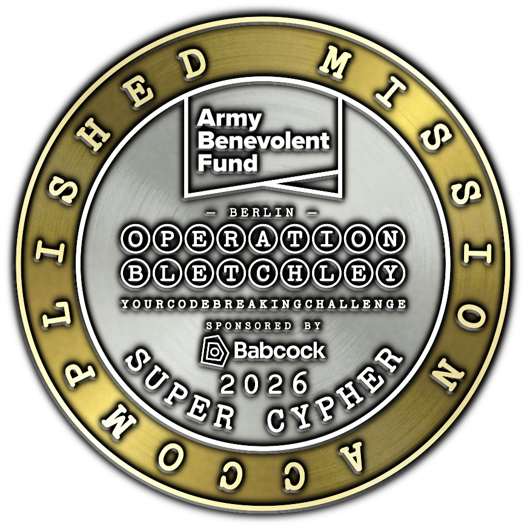

# op-bletchley-26
This repo stores the puzzles and scripts used by me to
solve [Operation Bletchley 26](https://events.armybenevolentfund.org/event/operation-bletchley-berlin/home).

Thanks to Howard Easton for inviting me on his team to
solve the 31 puzzles, across 4 levels:
 # Junior 
 ##### [1. Circular Thinking](./Junior/1-Circular-Thinking.pdf)
 ##### [2. Backwards Reasoning](./Junior/2-Backwards-Reasoning.pdf)
 ##### [3. Carry The Flag](./Junior/3-Carry-The-Flag.pdf)
 ##### [4. What's Missing](./Junior/4-Whats-Missing.pdf)
 ##### [5. L Is For ...?](./Junior/5-L-Is-For.pdf)
 ##### [6. Mysterious Messages](./Junior/6-Mysterious-Messages.pdf)
 ##### [7. Gerbildoku](./Junior/7-Gerbildoku.pdf)
 ##### [8. Movie Editing](./Junior/8-Movie-Editing.pdf)
 ##### [9. Out Of The Box](./Junior/9-Out-Of-The-Box.pdf)
 ##### [10. Final Puzzle](./Junior/10-Final-Puzzle.pdf)

 # Codebreaker 
 ##### [1. Doubly Puzzling](./Codebreaker/1-Doubly-Puzzling.pdf)
 ##### [2. Chess Peace](./Codebreaker/2-Chess-Peace.pdf)
 ##### [3. Three For One](./Codebreaker/3-Three-For-One.pdf)
 ##### [4. Double Meanings](./Codebreaker/4-Double-Meanings.pdf)
 ##### [5. In The Shade](./Codebreaker/5-In-The-Shade.pdf)
 ##### [6. Berlin Sightseer](./Codebreaker/6-Berlin-Sightseer.pdf)
 ##### [7. 25714368](./Codebreaker/7-25714368.pdf)
 ##### [8. Case By Case](./Codebreaker/8-Case-By-Case.pdf)
 ##### [9. U-Are-Gold](./Codebreaker/9-U-Are-Gold.pdf)
 ##### [10. Final Puzzle](./Codebreaker/10-Final-Puzzle.pdf)

 # Cypher Expert 
 ##### [1. Humble](./CypherExpert/1-Humble.pdf)
 ##### [2. Train Times](./CypherExpert/2-Train-Times.pdf)
 ##### [3. Removing The Foundations](./CypherExpert/3-Removing-The-Foundations.pdf)
 ##### [4. Mystery Maths](./CypherExpert/4-Mystery-Maths.pdf)
 ##### [5. Strange Sequence](./CypherExpert/5-Strange-Sequence.pdf)
 ##### [6. More Or Less](./CypherExpert/6-More-Or-Less.pdf)
 ##### [7. A Meaningful Observation](./CypherExpert/7-A-Meaningful-Observation.pdf)
 ##### [8. Building Bridges](./CypherExpert/8-Building-Bridges.pdf)
 ##### [9. Grid System](./CypherExpert/9-Grid-System.pdf)
 ##### [10. Final Puzzle](./CypherExpert/10-Final-Puzzle.pdf)

 # Super Cypher 
 ##### [1. As Easy As PK...](./SuperCypher/SuperCypher.pdf)

The various folders show the puzzles for each level.

Mike
